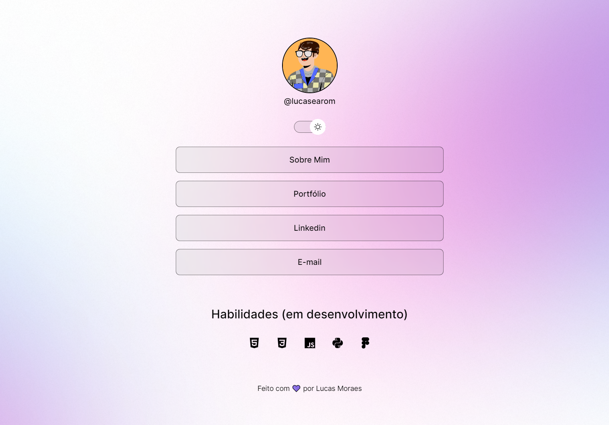

<h1 align="center"> Projeto DevLinks </h1>

  

## 💻 Descrição do projeto

Através do curso de Programação Web da Rocketseat, foi desenvolvido um site para agrupar links, com HTML, CSS e Javascript, na pratica. Projeto realizado com o intuito de servir como um cartão de visita online.

## 📚 Aprendizagem

- HTML
- CSS (espaçamento, pseudo-classes, :root, ...)
- Javascript (alteração entre dark e light mode)
- Figma
- Git e Github

## Status do projeto: Concluído ✅
